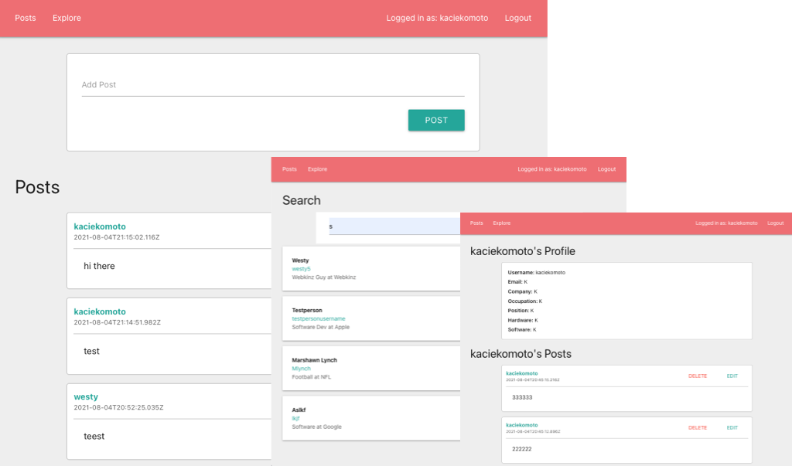
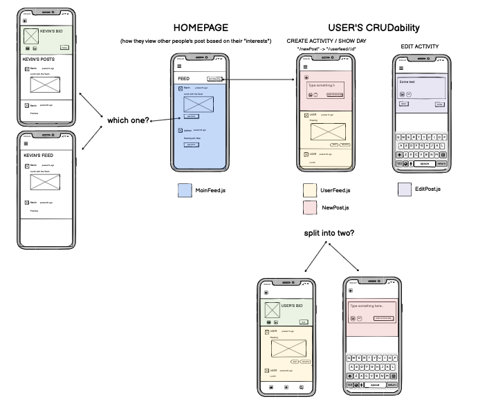

# Follow Me {ignore=true}
#### By Weston Perkins, Kacie Komoto, Quan Nguyen {ignore=true}
#### Test it out here: [Follow Me](https://followmeapplication.herokuapp.com/) {ignore=true}

<!-- @import "[TOC]" {cmd="toc" depthFrom=1 depthTo=6 orderedList=false} -->

<!-- code_chunk_output -->

- [About Follow Me](#about-follow-me)
  - [Languages & Frameworks Used](#languages-frameworks-used)
- [Wireframes](#wireframes)
- [User Stories](#user-stories)
- [Major Hurdles](#major-hurdles)
- [Ideas for Future Modifications](#ideas-for-future-modifications)

<!-- /code_chunk_output -->

 
## About Follow Me
Our app allows users to share activities from the day-to-day of their jobs. By sharing their day-to-day work-related activities, the app can provide user to see other real-world examples of jobs or companies they're interested in. 

### Languages & Frameworks Used
- React
- JavaScript
- CSS3
- Node.js
- Mongo
- Mongoose
- Express

## Wireframes
<!-- @import "[TOC]" {cmd="toc" depthFrom=1 depthTo=6 orderedList=false} -->

<!-- code_chunk_output -->

- [About Follow Me](#about-follow-me)
  - [Languages & Frameworks Used](#languages-frameworks-used)
- [Wireframes](#wireframes)
- [User Stories](#user-stories)
- [Major Hurdles](#major-hurdles)
- [Ideas for Future Modifications](#ideas-for-future-modifications)

<!-- /code_chunk_output -->

## User Stories
- The user can login or register with a new account
- The user will be able to create a posts 
- The user will be able to read through a feed with other people's posts
- The user can read, update, and delete their posts
- The user can search through other users profiles

## Major Hurdles
 1. Getting CRUD Frontend routes to communicate with the Backend CRUD routes
 2. Working with Git Workflow

## Ideas for Future Modifications
1. Allow user to upload more than text for their Posts. For example:
    - Image Upload
    - Gifs
2. Allow users to upload profile picture
3. Add ability to like and share certain activities
4. Add ability for user to "follow" other users
5. Improve UX/UI Elements and Usability Testing. For example:
    - Logout not in Nav Bar
    - Error message before deleting post

